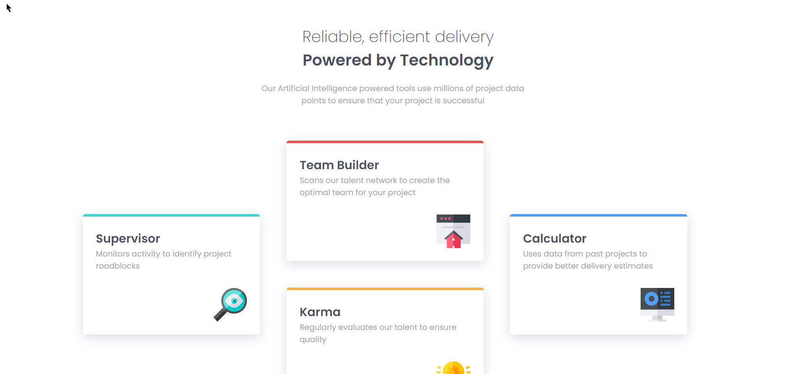

# Frontend Mentor - Four card feature section solution

This is a solution to the [Four card feature section challenge on Frontend Mentor](https://www.frontendmentor.io/challenges/four-card-feature-section-weK1eFYK). Frontend Mentor challenges help you improve your coding skills by building realistic projects.

## Table of contents

-   [Overview](#overview)
    -   [The challenge](#the-challenge)
    -   [Screenshot](#screenshot)
    -   [Links](#links)
-   [My process](#my-process)
    -   [Built with](#built-with)
    -   [What I learned](#what-i-learned)
    -   [Continued development](#continued-development)
    -   [Useful resources](#useful-resources)
-   [Author](#author)
-   [Acknowledgments](#acknowledgments)

## Overview

### The challenge

Users should be able to:

-   View the optimal layout for the site depending on their device's screen size

### Screenshot

### Links

-   Solution URL: [Frontend Mentor Solution](https://www.frontendmentor.io/solutions/mobile-first-four-card-component-HB0R3s_-d)
-   Live Site URL: [Netlify Live Site](https://crimson-four-card.netlify.app/)

## My process

### Built with

-   Semantic HTML5 markup
-   CSS custom properties
-   Flexbox
-   Mobile-first workflow

## Author

-   Website - [Vaideeswaran C](https://www.vaideeswaranc.com)
-   Frontend Mentor - [@vaideeswaran23](https://www.frontendmentor.io/profile/vaideeswaran23)
-   Twitter - [@vaideeswaran23](https://www.twitter.com/vaideeswaran23)
